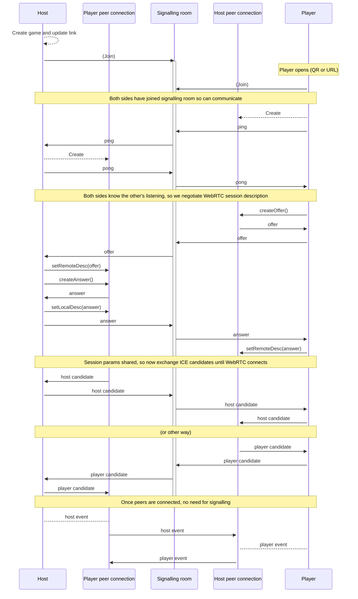

Peer to peer starter
====================

A toy to explore simple hub and spoke peer to peer applications built on WebRTC between supporting browsers.

Features
--------

- Web app served as static files only i.e. no server state/database etc.
- One peer acts as "host" hosting a "game" (this is not required but fits the hub and spoke P2P game use case)
- Multiple "players" can join the "game", and communicate P2P with the host
- All web based, only browsers needed
- All peer-to-peer client based state only, no server state
- WebRTC connection negotiated via temporary WebSocket connection to a signalling server

Notes
-----

- Signalling is required to set up WebRTC
- Signalling server is application agnostic, just broadcasts to all peers subscribed to the "game" room
- The signalling could be via QR codes and scanning if all peers support it
- To allow for dumb hosts (e.g. TVs) this starter uses a WebSocket signalling approach

Tech stack
----------

- Vanilla JS modules
- No build step
- WebSocket signalling for WebRTC negotiation
- WebRTC for Host-Player connection
- Browser motion API for events
- (for optional QR) `qr-code` library (single WebComponent) loaded via CDN

Communication
-------------

Two web browsers end up communicating P2P after the following flow:

1. [Host] Load page (/host.html)
2. [Host] Create and display game, provide link to Player to join Game (/player.html?game=ID)
3. [Player] Scan QR code navigate to provided URL
4. [Both] Negotiate a P2P connection using temporary connection to signalling
5. [Both] Drop the signalling connection and communicate purely P2P



Development
-----------

**Dependencies**

- Make - for some utility tasks
- NodeJS - to serve files locally
- openssl - to generate self signed certs

**HTTPS**

There is no build step but in order to use the browser motion API there's a need to access the client app over HTTPS.  Easiest way to do that is make sure your dev machine announces itself via mDNS (MacOS has Bonjour, Linux has Avahi) then use "<hostname>.local":

```bash
DUMMY_HOSTNAME=<changethis>.local make server
```
