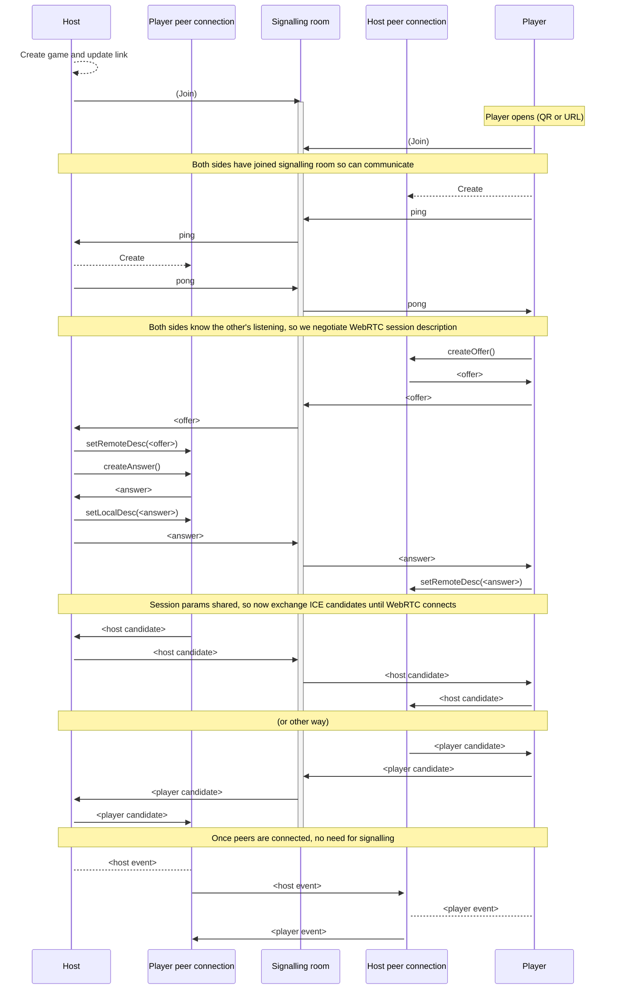

Peer to peer starter
====================

A toy to explore simple hub and spoke peer to peer applications built on WebRTC between supporting browsers.

Features
--------

- Single "host" hosting a "game"
- Multiple "players" can join the game
- All web based, only browsers needed
- All peer-to-peer client based state only, no server state (web app served as static files)
- WebRTC connection negotiated by a (shared) app agnostic signalling server

Communication
-------------

1. Load page (/index.html)
2. By default start "Host", give link to "Player" URL (/player.html)
3. For host: create and display game, provide link to Player to join Game (/player.html?game=ID)
3. For player: enter game ID to join (if not provided in URL)
4. Player starts sending "commands" to host
5. Host continually processes commands, updating and displaying game state



Tech stack
----------

- SPA
- Vanilla JS where possible
    - Reset UI each state change?
    - WebRTC for Host-Player connection
    - WebSocket signalling for WebRTC negotiation
    - Browser motion API for events
    - Single `main.js` script loaded as module in HTML
    - Other `.js` files imported normally, browser will load
- `qr-code` library (single WebComponent)

Development
-----------

**Dependencies**

- Make - for some utility tasks
- NodeJS - to serve files locally
- openssl - to generate self signed certs

**HTTPS**

There is no build step but in order to use the browser motion API there's a need to access the client app over HTTPS.  Easiest way to do that is make sure your dev machine announces itself via mDNS (MacOS has Bonjour, Linux has Avahi) then use "<hostname>.local":

```bash
DUMMY_HOSTNAME=<changethis>.local make server
```
